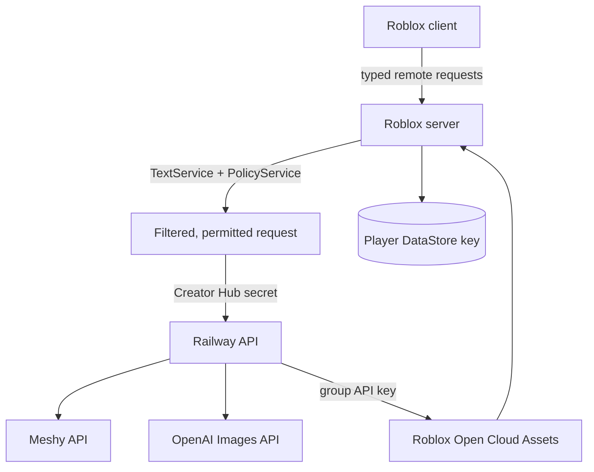
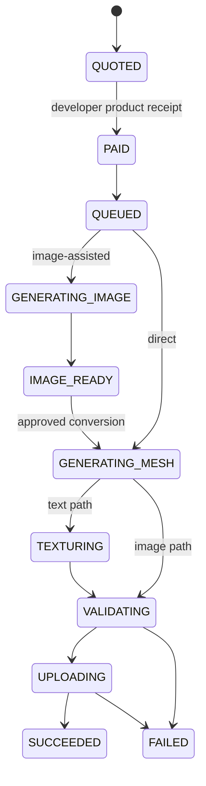

# Architecture

## Trust boundaries

The client is never trusted with prices, ownership, fit bounds, product IDs, provider URLs, secrets, or receipt state. Railway never accepts a player-supplied identity directly; it accepts the Roblox server's authenticated user ID and request ID.

## Generation state machine

The live backend and its second-stage text moderation must respond successfully before a developer-product prompt can open. Provider, validation, upload, and infrastructure failures after payment grant an in-game retry credit for the same operation. A post-payment content rejection is also recovered as a credit because the prompt already passed preflight. Retry credits are not Robux and cannot be transferred.

Developer-product intent data is saved before Roblox is prompted. Receipt grants use deterministic generation IDs, write the durable benefit and receipt marker to the player's profile before acknowledging Roblox, and submit the same backend request ID on every retry. Plus transfers likewise persist a source snapshot and transfer request ID before a sender receipt can grant a deterministic personal copy.

## Persistence

`ForgeUGC_Player_v1` stores one document per user key (`u_<userId>`):

- original and purchased item records;
- generation jobs and preview state;
- fit transforms and equipped item IDs;
- liked/favorited item references;
- pending generation purchases and Plus transfers;
- processed developer-product receipt IDs;
- settings, onboarding, streak, and analytics counters.

`ForgeUGC_ItemIndex_v1` contains only public item IDs, owner IDs, engagement counters, and ranking timestamps. Trending scores are calculated from that index; the owner profile remains canonical. This small shared index is necessary because Roblox DataStores cannot enumerate every player key for marketplace discovery.

The raw GLB/PNG bytes are never placed in a DataStore. Roblox DataStores are metadata stores with strict value-size limits. Final files become Roblox assets; temporary provider artifacts live only long enough for Railway to validate and upload them.

## Roblox asset lifecycle

1. Railway downloads the provider result immediately because Meshy URLs expire.
2. The GLB is normalized before upload: compatible Smart Topology parts are flattened and joined, then the result must contain exactly one mesh/primitive/node, watertight manifold geometry with usable UVs, fewer than 4,000 triangles and vertices, finite coordinates, no rig or animation data, an embedded base-color texture normalized to PNG at no more than 2048×2048, and a final file below the configured upload cap.
3. Generated reference images, embedded textures, and thumbnails pass multimodal safety moderation before upload.
4. Railway uploads the GLB as a group-owned Model using the Open Cloud Assets API.
5. The Roblox server loads the owned model with `AssetService:LoadAssetAsync()` for private fitting and in-game equip.
6. Final platform-wide creation uses `AvatarCreationService:PromptCreateAvatarAssetAsync()` and an Avatar Creation Token matching the selected accessory type.

## Marketplace license model

- `ORIGINAL` — may be made public, listed, fitted, equipped, or sent through avatar creation by its owner.
- `PERSONAL_COPY` — may be independently fitted, equipped, and sent through avatar creation by its buyer; may never be listed, transferred, or used as a source listing.

Trying on a public item is free and does not require Plus or an active listing. Buying requires an active listing and a Roblox Plus transfer between 10 and 500 Robux. The buyer receives the copy only after the sender receipt is processed.

## Analytics boundary

Only server-authored events and three tightly allowlisted client events reach `AnalyticsService`. Fields are enumerated or numeric, capped in count and length, and never contain prompts, item names, catalog queries, or provider responses. See `docs/ANALYTICS.md` for the launch scorecard and decision cadence.
