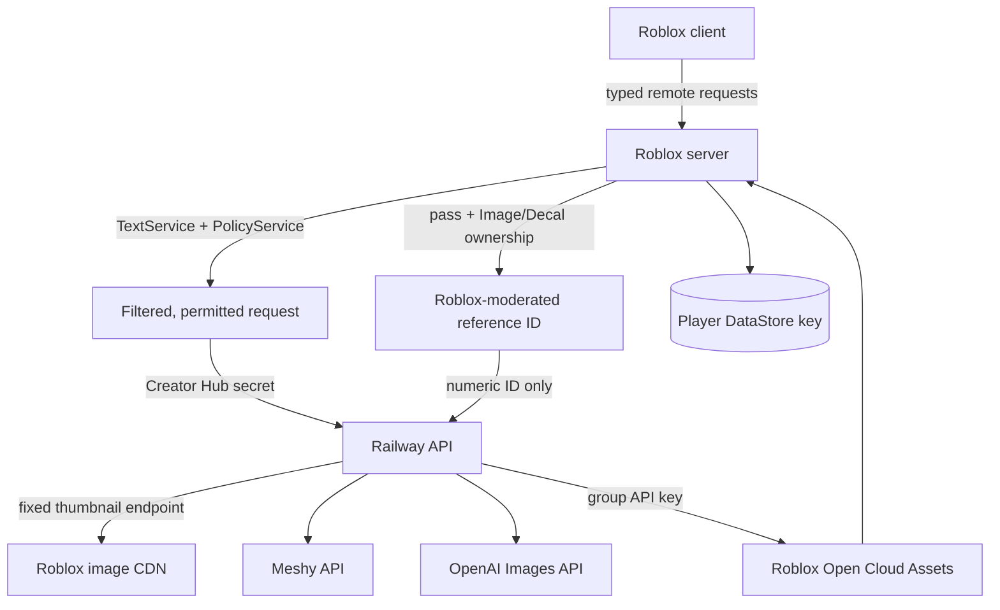
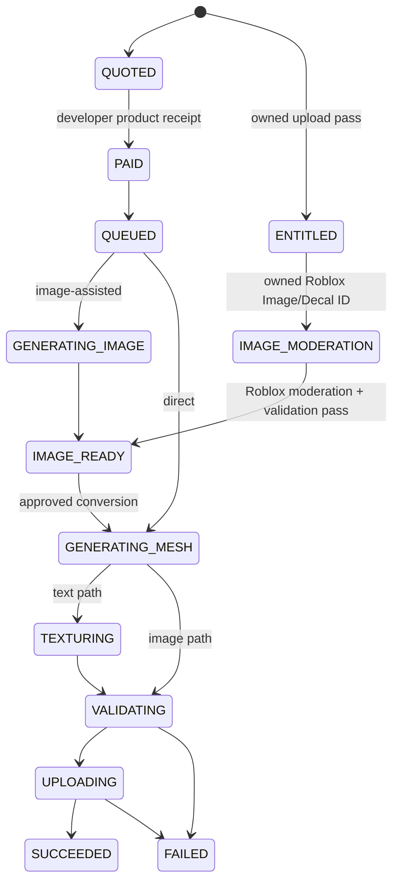

# Architecture

## Trust boundaries

The client is never trusted with prices, pass ownership, image ownership, fit bounds, product IDs, provider URLs, secrets, or receipt state. Railway never accepts a player-supplied identity directly; it accepts the Roblox server's authenticated user ID and request ID. Custom-image jobs accept a numeric Roblox asset ID only; the backend never fetches a player-supplied URL.

## Generation state machine

The live backend and its second-stage text moderation must respond successfully before a developer-product prompt can open. Provider, validation, upload, and infrastructure failures after payment grant an in-game retry credit for the same operation. A post-payment content rejection is also recovered as a credit because the prompt already passed preflight. Retry credits are not Robux and cannot be transferred.

Custom-image submission has no per-submission developer product. The Roblox server rechecks the permanent game pass, content-sharing policy, asset type, and creator ownership. Railway resolves the already moderated asset through Roblox's fixed thumbnail API, restricts downloads to HTTPS Roblox CDN hosts, and validates/normalizes the still image. It does not purchase a redundant OpenAI vision check for that Roblox-approved upload. Only an `IMAGE_READY` reference can become the source of the separately paid image-to-3D conversion. The conversion copies the image into its own durable job before starting Meshy and carries the Roblox-moderated preview asset ID as a recovery source, so an expired preview artifact or backend redeploy does not invalidate an already approved reference.

Style and detail choices are strict enums, not free-form instructions. Railway expands them into trusted prompt guidance for OpenAI reference generation and Meshy geometry/texture prompts. Meshy's deprecated `art_style` parameter is deliberately not used.

The Art-Directed reference image has three purchasable quality tiers (`LOW`/`MEDIUM`/`HIGH`), each a distinct developer product because Roblox product prices cannot vary per purchase. A tier maps 1:1 onto the OpenAI `quality` request parameter (`low`/`medium`/`high`); the Roblox server resolves the player's chosen tier to both a product key and that provider parameter (`Config.Generation.ImageQualityTiers`) and forwards only the OpenAI-facing value to Railway. `imageQuality` is optional on `POST /v1/jobs` and valid only for `IMAGE_PREVIEW`; when absent, Railway falls back to its own `OPENAI_IMAGE_QUALITY` default. See `docs/PRICING.md` for the per-tier cost/price estimates.

Developer-product intent data is saved before Roblox is prompted. Receipt grants use deterministic generation IDs, write the durable benefit and receipt marker to the player's profile before acknowledging Roblox, and submit the same backend request ID on every retry. Plus transfers likewise persist a source snapshot and transfer request ID before a sender receipt can grant a deterministic personal copy.

## Forge Tokens and rewarded ads

Every product `CommerceService` grants can be bought with Robux (`BeginIntent`) or with Forge Tokens (`BeginIntentWithTokens`); the client only ever chooses which one to request, the server recomputes the token price from the live Robux price and enforces the player's balance. `BeginIntentWithTokens` deducts tokens then calls the exact same registered `GrantHandler` a real receipt or a Studio mock purchase would call, so a product's grant logic never needs to know which payment path funded it.

`AchievementService` grants a one-time Forge Tokens reward per milestone (`src/Shared/Achievements.luau` is the shared definition list, so the client can render locked/unlocked state without a server round trip). Each hook lives at the point an action genuinely completed, not where it was merely requested — e.g. `FIRST_AD_WATCHED` unlocks in `AdRewardService:RequestAd` on a confirmed `Enum.ShowAdResult.ShowCompleted`, deliberately not in the shared `AdRewardTokens` grant handler, since that handler also fires for a plain Robux purchase of the same product. `FIRST_INVITE_SENT` is the one achievement with client-reported completion (`SocialService.GameInvitePromptClosed` only exists client-side, and Roblox exposes no accepted-invite signal at all) — the reward is for taking the native-UI-verified action of sending an invite, not for a friend joining, and stays small enough that a spoofed report is a negligible economic risk. Each achievement also awards a Roblox badge via `BadgeService:AwardBadgeAsync` once `Config.Achievements.BadgeIds[id]` is configured (skipped, not failed, while it's still the `0` placeholder). `Unlock` auto-grants the `COMPLETIONIST` bonus achievement the moment every other one is unlocked for that player — never call `Unlock`/`CheckCount` with that id directly. Because none of these tokens are backed by ad revenue or a Robux payment, `AchievementService.new` sums every achievement's token value against `Config.Achievements.NonEarningTokenBudget` and `error()`s at startup if it's over, the same fail-closed pattern `CommerceService` uses for conflicting product IDs; see `docs/PRICING.md` for how that budget is derived.

Forge Tokens are earned by watching a Roblox Rewarded Video ad (`Class.AdService`), which Roblox splits across two run contexts: `AdService:GetAdAvailabilityNowAsync` may only run on the client, while `AdService:CreateAdRewardFromDevProductId` and `AdService:ShowRewardedVideoAdAsync` may only run on the server. The client checks availability itself (gating the "Watch ad" button) and asks the server to show the ad; `AdRewardService` does the privileged half and reports `AD_NOT_COMPLETED` for any `Enum.ShowAdResult` other than `ShowCompleted`, per Roblox's own guidance not to grant off that return value. The actual grant always arrives asynchronously through the same `MarketplaceService.ProcessReceipt` callback `CommerceService` already installs for every developer product — Roblox routes a completed rewarded ad through that identical pipeline (with `receipt.ProductPurchaseChannel == Enum.ProductPurchaseChannel.AdReward`), so `AdRewardService` only needs to register one `GrantHandler` for `Config.Products.AdRewardTokens`, exactly like any other product.

## Persistence

`ForgeUGC_Player_v1` stores one document per user key (`u_<userId>`):

- original and purchased item records;
- generation jobs and preview state;
- style/detail selections and custom Roblox reference IDs;
- fit transforms, equipped item IDs, and named fit presets;
- liked/favorited item references;
- pending generation purchases and Plus transfers;
- Forge Token balance and the daily rewarded-ad watch counter;
- processed developer-product receipt IDs;
- settings, onboarding, streak, and analytics counters.

`ForgeUGC_ItemIndex_v1` contains only public item IDs, owner IDs, current listing state/price, engagement counters, and ranking timestamps. Trending scores and cross-server listing availability are calculated from that index; the owner profile remains canonical for ownership, licensing, visibility, and the source model. This small shared index is necessary because Roblox DataStores cannot enumerate every player key for marketplace discovery.

The raw GLB/PNG bytes are never placed in a DataStore. Roblox DataStores are metadata stores with strict value-size limits. Final files become Roblox assets; temporary provider artifacts live only long enough for Railway to validate and upload them.

## Roblox asset lifecycle

1. Railway downloads the provider result immediately because Meshy URLs expire.
2. The GLB is normalized before upload: compatible Smart Topology parts are flattened and joined; unused vertices, degenerate/duplicate faces, and safely repairable simple boundary loops are cleaned up; then the result must contain exactly one mesh/primitive/node, watertight manifold geometry with usable UVs, fewer than 4,000 triangles and vertices, finite coordinates, no rig or animation data, an embedded base-color texture normalized to PNG at no more than 2048×2048, and a final file below the configured upload cap. Image reconstruction targets 3,000 faces (instead of the direct path's 3,600) to leave room for UV seams and repair faces under both Roblox limits.
3. Generated references, embedded textures, and thumbnails pass provider visual moderation before display or upload. Player-supplied references rely on completed Roblox moderation plus Forge ownership/type/CDN/image validation.
4. Railway uploads the GLB as a group-owned Model using the Open Cloud Assets API.
5. The Roblox server loads the owned model with `AssetService:LoadAssetAsync()` for private fitting and in-game equip.
6. Final platform-wide creation uses `AvatarCreationService:PromptCreateAvatarAssetAsync()` and an Avatar Creation Token matching the selected accessory type.

Equipping and unequipping are both server-authoritative (`ItemService:Equip`/`Unequip`). The player's `equippedItemIds` list is the durable record; the live `Accessory` instance is tagged with a `ForgeItemId` attribute so the server can find and remove the exact accessory on unequip, or skip re-adding one `RestoreEquipped` already finds present after a respawn.

`AccessoryFit.FindAvatarAttachment` (used only by the client-side fitting preview) resolves the target attachment by scanning the avatar model's own direct-child `BasePart`s, not a recursive `FindFirstChild(name, true)`. Every worn Accessory's Handle carries an attachment with the same name as the body attachment it welds to — that is how `Humanoid:AddAccessory` matches them — so a recursive search over the whole avatar tree can return a currently-equipped accessory's attachment instead of the body's, misplacing the item being fitted.

Meshy's exported GLB places its own mesh origin inconsistently between generations — sometimes the bounding-box center, sometimes a corner — and `fit.position = (0,0,0)` pins that origin directly to the avatar attachment, so an all-zero default fit reads as a randomly offset item. `GenerationService:_ComputeInitialFit` loads the freshly completed model once at generation-completion time (via `ItemService:LoadModelForInspection`, which shares the same asset cache and Open Cloud propagation retry as every other model load) and calls `AccessoryFit.ComputeDefaultPosition` to seat a geometric anchor of the real mesh — bounding-box floor for Hat/Hair/Face, bounding-box center for everything else — on the attachment instead. This only sets the item's *starting* `fit.position`; it runs once, is best-effort (any failure falls back to the previous all-zero position rather than blocking item creation), and a player can still freely redial position/rotation/scale afterward.

### Model queue time

A finished model is not handed to the player the instant the backend pipeline reports `SUCCEEDED`. `GenerationService._Prepare` stamps every model-producing generation (`TEXT_TO_3D`/`IMAGE_TO_3D` only — reference images are unaffected) with `minReadyAt`, a random point `Config.Generation.ModelQueueSeconds` (or the much shorter `PriorityModelQueueSeconds`, for group members and anyone spending a Priority Pass on that generation) after creation. `_Poll` keeps its existing poll loop running past a real `SUCCEEDED` response until `os.time() >= minReadyAt`, calling `_CompleteModel` only then; `backend:GetJob` on an already-finished job is cheap and idempotent, so this costs nothing extra. `minReadyAt` is a persisted absolute timestamp, not an in-memory timer, so it survives a disconnect/reconnect or server hop exactly like every other in-flight generation state.

While waiting, the poll loop paces `generation.stage`/`stageText`/`progress` through a synthetic `FINISHING` stage (`finishingStageFor`) that climbs from wherever the real backend progress last was up to 99 — never backward, and never showing 100 until the item is actually created — cycling through a handful of generic finishing-sounding messages. `FINISHING` is deliberately not in the `TERMINAL` table, so `Resume()` keeps re-polling a generation left mid-wait after a reconnect exactly like any other in-progress one. This is the entire mechanism behind why buying (or earning) Priority Pass materially shortens the wait for a model: the pipeline's real work is normally much faster than either queue range, group members and Priority Pass both key off the same `priority` flag `_Prepare` already computed for `retryCredits.PriorityPass`.

A player may save the fit currently being dialed in (position/rotation/scale) as a named preset under `profile.fitPresets`/`fitPresetOrder`, independent of any item's in-progress `fitDrafts` entry on the client, so applying a preset never discards whatever fit is being worked on for a different item.

## Marketplace license model

- `ORIGINAL` — may be made public, listed, fitted, equipped, or sent through avatar creation by its owner.
- `PERSONAL_COPY` — may be independently fitted, equipped, and sent through avatar creation by its buyer; may never be listed, transferred, or used as a source listing.

Trying on a public item is free and does not require Plus or an active listing. Buying requires an active listing and a Roblox Plus transfer between 10 and 500 Robux. The buyer receives the copy only after the sender receipt is processed. A transfer waiting for a receipt never blocks a later prompt: only a prompt currently open in the same live server is exclusive. Recovery markers retain the validated listing snapshot by transfer request ID, so a late successful receipt remains grantable after the player rejoins or the short-lived profile intent is cleaned up.

`LeaderboardService` maintains a separate `OrderedDataStore` ranking players by `profile.stats.likesReceived`, updated inline whenever `CommunityService:_ToggleReaction` changes a like count (fire-and-forget — a DataStore failure there must never block the like/unlike action itself). `GetTop` reads the top `Config.Leaderboard.TopCount` entries and resolves display names lazily; like `ItemIndex`, it is a ranking convenience, not a source of truth.

`CommunityService:GetMarketplace` accepts an optional `searchBy` (`NAME` default, or `CREATOR` to match the resolved owner display name instead of the item name) and `sortBy` (`TRENDING` default engagement score, `NEWEST`, `PRICE_LOW`, `MOST_LIKED`). All four sort modes read the same public index scan already required for pagination, so no additional DataStore reads are introduced.

## Analytics boundary

Only server-authored events and three tightly allowlisted client events reach `AnalyticsService`. Fields are enumerated or numeric, capped in count and length, and never contain prompts, item names, catalog queries, or provider responses. See `docs/ANALYTICS.md` for the launch scorecard and decision cadence.
